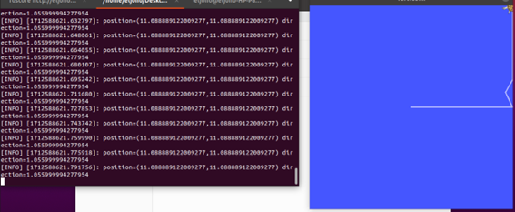
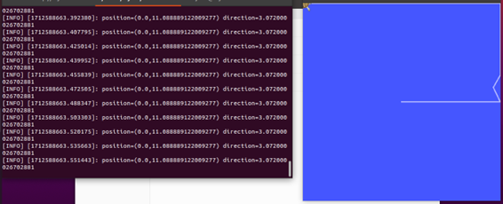
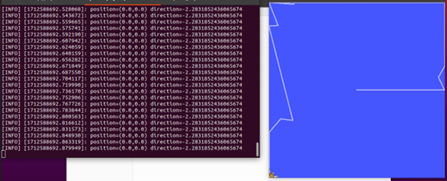
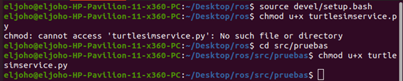
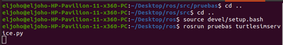
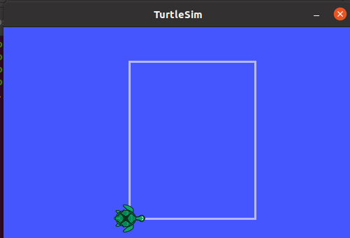
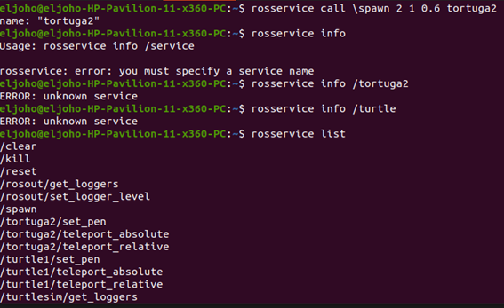
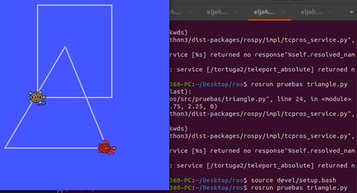

# Laboratorio No. 03 - 2024-II - Robotica de Desarrollo, Intro a ROS
# Robotica


# Integrantes:
- Crisitian Cuestas
- Johan López

# Contenido
En el repositorio de este laboratorio se encuentra lo siguiente:
- README.md -> Archivo base con la descripción del laboratorio.
- Imgs -> Carpeta con imágenes utilizadas en el archivo README.
- ros -> Proyecto de ROS utilizado en el laboratorio.

Tabla de Contenidos
---

- [¿Qué es ROS?](#qué-es-ros)
   - [Ventajas de ROS](#ventajas-de-ros)
- [Comandos ROS](#comandos-ros)
   - [rosnode](#rosnode)
   - [rostopic](#rostopic)
   - [rosservice](#rosservice)
   - [rosmsg](#rosmsg)
   - [rospack](#rospack)
- [Descripción PYPUVEL.PY](#descripción-del-programa-pypuvelpy)
- [Descripción PYSUBPOSE.PY](#descripción-del-programa-pysubposepy)
- [Dimensiones del plano](#obteniendo-dimensiones-del-plano-con-turtle_teleop_key-y-pysubposepy)
- [Servicios SPAWN y TELEPORT_ABSOLUTE](#servicios-spawn-y-teleport_absolute)
   - [spawn](#spawn)
   - [teleport_absolute](#teleport_absolute)
- [Uso de TURTLESIMSERVICE.PY](#uso-de-turtlesimservicepy)
- [Dibujando con 2 tortugas](#creando-un-cuadrado-y-triangulo-con-dos-tortugas)

# ¿Qué es ROS?

## ROS (Robot Operating System)

ROS es un conjunto de herramientas y bibliotecas de software de código abierto para el desarrollo de aplicaciones robóticas. Aunque no es un sistema operativo en sí mismo, proporciona un marco de trabajo flexible que se ejecuta sobre Linux.

## Ventajas de ROS:

- **Arquitectura modular**: Permite dividir el desarrollo del robot en nodos independientes que se comunican eficientemente entre sí.
- **Comunidad activa**: Gran comunidad de usuarios y desarrolladores que contribuyen con paquetes, tutoriales y soporte técnico.
- **Reutilización de código**: Ofrece una amplia gama de paquetes y bibliotecas preexistentes para funciones robóticas comunes.
- **Herramientas de desarrollo**: Proporciona herramientas para visualización, simulación, depuración y análisis, facilitando el desarrollo de aplicaciones robóticas.
- **Flexibilidad y escalabilidad**: Adaptable a una variedad de plataformas y configuraciones de hardware, desde robots simples hasta sistemas complejos.
- **Interoperabilidad**: Compatible con varios lenguajes de programación y sistemas de middleware, permitiendo la integración de diferentes componentes de software y hardware.

# Instalación de ROS2 en una máquina con OS Windows 11

Se escogió Miniforge3, una distribución de Conda/Mamba optimizada para usar el canal conda-forge, para instalar ROS 2 de forma sencilla, sin necesidad de usar Docker o WSL en Windows.

## 1. Instalación de Miniforge3

1. Descargar el instalador para windows desde [el repositorio oficial de Miniforge3](https://github.com/conda-forge/miniforge?tab=readme-ov-file#windows).

2. Ejecutar el instalador.

3. Dar click en el primer "Next" y leer y aceptar el "License Agreement".

4. En el tipo de instalación, seleccionar "Just me (recommended)" y "Next".

5. Determinar el directorio en donde se van a instalar los paquetes y "Next".

6. Marcar las opciones de 

    - Agregar Miniforge3 al PATH environment variable
    - Registrar Miniforge3 como el Python por defecto 

7. Dar click en instalar y esperar a que se realice la instalación

## 2. Creación del canal 


# Comandos ROS
https://w3.cs.jmu.edu/spragunr/CS354_F17/handouts/ROSCheatsheet.pdf

## rosnode
- *rosnode cleanup*: Elimina nodos que han sido desconectados del grafo de comunicación.
- *rosnode info*: Proporciona información detallada sobre un nodo específico.
- *rosnode kill*: Detiene un nodo en ejecución.
- *rosnode list*: Lista todos los nodos actualmente en ejecución.
- *rosnode machine*: Muestra todos los nodos que se ejecutan en una máquina específica.
- *rosnode ping*: Verifica si un nodo está en línea y responde a los mensajes.

## rostopic
- *rostopic bw*: Muestra el ancho de banda utilizado por un tópico.
- *rostopic echo*: Muestra los mensajes que se publican en un tópico.
- *rostopic find*: Encuentra tópicos por su nombre.
- *rostopic hz*: Muestra la frecuencia de publicación de un tópico.
- *rostopic info*: Proporciona información detallada sobre un tópico específico.
- *rostopic list*: Lista todos los tópicos actualmente en uso.
- *rostopic pub*: Publica datos en un tópico.
- *rostopic type*: Muestra el tipo de mensajes que se publican en un tópico.

## rosservice
- *rosservice args*: Muestra los argumentos de un servicio.
- *rosservice call*: Llama a un servicio con argumentos específicos.
- *rosservice find*: Encuentra servicios por su nombre.
- *rosservice info*: Proporciona información detallada sobre un servicio específico.
- *rosservice list*: Lista todos los servicios disponibles.
- *rosservice type*: Muestra el tipo de datos que se espera que un servicio utilice.
- *rosservice uri*: Muestra la URI (Identificador de Recursos Uniforme) de un servicio.

## rosmsg
- *rosmsg list*: Lista todos los tipos de mensajes disponibles.
- *rosmsg md5*: Muestra el MD5 sum de un tipo de mensaje.
- *rosmsg package*: Muestra todos los tipos de mensajes en un paquete específico.
- *rosmsg packages*: Lista todos los paquetes que contienen tipos de mensajes.
- *rosmsg show*: Muestra la definición de un tipo de mensaje.

## rospack
- *rospack find*: Encuentra la ubicación de un paquete.
- *rospack list*: Lista todos los paquetes disponibles.
- *rospack info*: Proporciona información detallada sobre un paquete específico.

# Descripción del programa PYPUVEL.PY
- *Paso 1. Importar módulos necesarios:*  Se importa `rospy` y el tipo de mensaje `Twist` de `geometry_msgs.msg`, que se utiliza para enviar comandos de velocidad. También se importa `random` para generar números aleatorios.
- *Paso 2. Inicialización del nodo:*  
   - `rospy.init_node('pypubvel', anonymous=False)` Esta línea inicializa un nuevo nodo llamado 'pypubvel' en ROS. El argumento `anonymous=False` indica que el nombre del nodo no necesita ser único, permitiendo que múltiples instancias del mismo nodo tengan el mismo nombre.

- *Paso 3. Creación de un publicado:* `pub = rospy.Publisher('turtle1/cmd_vel', Twist, queue_size=1000)`: Esta línea crea un objeto publicador para enviar mensajes de tipo `Twist` al tópico `turtle1/cmd_vel`. El `queue_size=1000` define el tamaño de la cola de mensajes en espera para ser enviados.
- *Paso 4. Establecimiento de la frecuencia de publicación:* `rate = rospy.Rate(2)`: Define la frecuencia con la que se enviarán los mensajes. En este caso, se enviarán dos mensajes por segundo.
- *Paso 5. Bucle principal:*
     - `while not rospy.is_shutdown()`: Este bucle se ejecuta mientras el nodo de ROS esté activo y no se haya solicitado su cierre.
   - Dentro del bucle:
     - Se crea un nuevo mensaje de tipo `Twist`.
     - `msg.linear.x = random()`: Asigna un valor aleatorio entre 0 y 1 a la velocidad lineal en el eje x del mensaje.
     - `msg.angular.z = 2*random() - 1`: Asigna un valor aleatorio entre -1 y 1 a la velocidad angular en el eje z.
     - `rospy.loginfo(...)`: Registra información sobre el mensaje de velocidad que se va a enviar. Es útil para depuración y seguimiento del comportamiento del nodo.
     - `pub.publish(msg)`: Publica el mensaje en el tópico `turtle1/cmd_vel`.
     - `rate.sleep()`: Espera lo suficiente para mantener la tasa de publicación deseada (2 Hz en este caso).
    
```
#!/usr/bin/python3
import rospy
from geometry_msgs.msg import Twist
from random import random
if __name__ == '__main__':
    # Create a publisher on topic turtle1/cmd_vel, type geometry_msgs/Twist
    pub = rospy.Publisher('turtle1/cmd_vel', Twist, queue_size=1000)
    rospy.init_node('pypubvel', anonymous=False)
    rate = rospy.Rate(2)
    # Similar to while(ros::ok())
    while not rospy.is_shutdown():
        # Create and populate new Twist message
        msg = Twist()
        msg.linear.x = random()
        msg.angular.z = 2*random() - 1
        # Similar to ROS_INFO_STREAM macro, log information.
        rospy.loginfo('Sending random velocity command:' + ' linear=' + str(msg.linear.x) + ' angular=' + str(msg.angular.z))
        # Publish the message and wait on rate.
        pub.publish(msg)

rate.sleep()

```
# Descripción del programa PYSUBPOSE.PY
- *Paso 1. Importar módulos necesarios:*
  - `import rospy`: Importa la biblioteca rospy que permite usar Python para interactuar con ROS.
  - `from turtlesim.msg import Pose`: Importa el tipo de mensaje `Pose` del paquete `turtlesim`, que se utiliza para representar la posición y orientación de una tortuga en el simulador.
- *Paso 2. Definición de la función que maneja los mensajes:*
   - `def poseMessageReceived(message)`: Define una función que será llamada cada vez que se reciba un mensaje del tipo `Pose`.
   - Dentro de la función `rospy.loginfo(...)`: Registra la posición (x, y) y la orientación (`theta`) de la tortuga cada vez que se recibe un mensaje. Esta función es esencial para visualizar en el log de ROS la información recibida.
- *Paso 3. Inicialización del nodo:* `rospy.init_node('pysubpose', anonymous=False)`: Esta línea inicializa un nuevo nodo llamado 'pysubpose'. El argumento `anonymous=False` indica que el nombre del nodo no necesita ser único.
- *Paso 4. Creación de un suscriptor:* `sub = rospy.Subscriber('turtle1/pose', Pose, poseMessageReceived)`: Crea un objeto suscriptor que escucha en el tópico `turtle1/pose` y utiliza la función `poseMessageReceived` para manejar los mensajes recibidos. Cada vez que un mensaje `Pose` es publicado en ese tópico, la función `poseMessageReceived` es llamada con el mensaje como argumento.
- *Paso 5. Bucle de espera de eventos (spin):* `rospy.spin()`: Un bucle que mantiene el script ejecutándose y esperando por nuevos mensajes. A diferencia de otros bucles que manejan la frecuencia de ejecución manualmente, `rospy.spin()` simplemente bloquea y espera por eventos hasta que el nodo se apaga. Este método es útil cuando un nodo está dedicado principalmente a escuchar y procesar mensajes entrantes.
```
#!/usr/bin/python3
import rospy
from turtlesim.msg import Pose

def poseMessageReceived(message):
    rospy.loginfo('position=(' + str(message.x) + ',' + str(message.y) + ')' + ' direction=' + str(message.theta))

if __name__ == '__main__':
    rospy.init_node('pysubpose', anonymous=False)
    sub = rospy.Subscriber('turtle1/pose', Pose, poseMessageReceived)
    rospy.spin()

```

# Obteniendo dimensiones del plano con turtle_teleop_key y PYSUBPOSE.PY

Se obtienen las coordenadas de la esquina superior derecha.



Se obtienen las coordenadas de la esquina superior izquierda.



Se obtienen las coordenadas de la esquina inferior izquierda.



Se obtienen las coordenadas de la esquina inferior derecha.


Las dimensiones del plano son de 0 a 11.089 en X y en Y.

# Servicios SPAWN y TELEPORT_ABSOLUTE
   ## spawn
   - *Tipo de mensaje:* turtlesim/Spawn
   - *Descripción:* Añade una nueva tortuga a la simulación en una ubicación especificada con un nombre opcional.
   - *Argumentos x, y:* Coordenadas para la posición inicial. ;theta: Orientación inicial en radianes. ; name: Nombre opcional para la nueva tortuga.
   ## teleport_absolute
   - *Tipo de mensaje:* turtlesim/TeleportAbsolute
   - *Descripción:* Mueve la tortuga a una posición y orientación absolutas sin dejar rastro.
   - *Argumentos x, y:* Coordenadas de la nueva posición; theta: Nueva orientación en radianes.

# Uso de TURTLESIMSERVICE.PY

Se permite la ejecución como programa del archivo turtlesimservice.py .



Se usa setup.bash.



Se ejecutan dibuja un cuadrado con la tortuga.



# Creando un cuadrado y triangulo con dos tortugas
Primero se creo el programa llamado TRIANGLE.PY .
```
#!/usr/bin/python3
# La línea shebang indica que este script debe ejecutarse con Python 3.

import rospy  # Importa el módulo rospy, utilizado para escribir nodos de ROS en Python.
from turtlesim.srv import TeleportAbsolute  # Importa el tipo de servicio TeleportAbsolute de turtlesim.
from std_srvs.srv import Empty  # Importa el tipo de servicio Empty que no requiere argumentos y no retorna nada.

if __name__ == '__main__':  # Comprueba si este script es el punto de entrada principal para asegurarse de que no se ejecuta como módulo importado.
    rospy.init_node('turtlesimservice', anonymous=False)  # Inicializa un nodo de ROS llamado 'turtlesimservice'.

    rospy.wait_for_service('turtle1/teleport_absolute')  # Espera a que el servicio 'turtle1/teleport_absolute' esté disponible.
    turtle1_teleport = rospy.ServiceProxy('turtle1/teleport_absolute', TeleportAbsolute)  # Crea un proxy de servicio para llamar al servicio de teletransporte de la tortuga 1.

    rospy.wait_for_service('tortuga2/teleport_absolute')  # Espera a que el servicio 'tortuga2/teleport_absolute' esté disponible.
    tortuga2_teleport = rospy.ServiceProxy('tortuga2/teleport_absolute', TeleportAbsolute)  # Crea un proxy de servicio para llamar al servicio de teletransporte de la tortuga 2.

    rospy.wait_for_service('clear')  # Espera a que el servicio 'clear' esté disponible.
    clear1 = rospy.ServiceProxy('clear', Empty)  # Crea un proxy de servicio para llamar al servicio 'clear' que borra la pantalla.

    rate = rospy.Rate(0.3)  # Establece la frecuencia del bucle principal a 0.3 Hz (aproximadamente 3 segundos por ciclo).
    pos1=1  # Inicializa la posición de la tortuga 1.
    pos2=1  # Inicializa la posición de la tortuga 2.
    
    # Bucle principal que sigue ejecutándose hasta que el nodo de ROS se apague.
    while not rospy.is_shutdown():
        if (pos2==1):
            resp1 = tortuga2_teleport(2.25, 2.25, 0)  # Teletransporta la tortuga 2 a la posición (2.25, 2.25) con ángulo 0.
            clear1()  # Llama al servicio clear para borrar las huellas.
        if (pos2==2):
            resp1 = tortuga2_teleport(7.75, 2.25, 0)  # Teletransporta la tortuga 2 a otra posición.
        if (pos2==3):
            resp1 = tortuga2_teleport(5.5, 7.75, 0)  # Continúa teletransportando a la tortuga 2 a distintas posiciones.
        if (pos2==4):
            resp1 = tortuga2_teleport(2.25, 2.25, 0)  # Repite posición inicial para tortuga 2.
        if (pos2>4):
            pos2=1  # Reinicia la posición de la tortuga 2 si supera 4.
        pos2+=1  # Incrementa la posición de control para la tortuga 2.

        if (pos1==1):
            resp1 = turtle1_teleport(4, 5, 0)  # Teletransporta la tortuga 1 a la posición (4, 5) con ángulo 0.
            clear1()  # Llama al servicio clear para borrar las huellas de la tortuga 1.
        if (pos1==2):
            resp1 = turtle1_teleport(4, 10, 0)  # Continúa teletransportando a la tortuga 1 a distintas posiciones.
        if (pos1==3):
            resp1 = turtle1_teleport(8, 10, 0)
        if (pos1==4):
            resp1 = turtle1_teleport(8, 5, 0)
        if (pos1==5):
            resp1 = turtle1_teleport(4, 5, 0)  # Repite posición inicial para tortuga 1.
        if (pos1>5):
            pos1=1  # Reinicia la posición de la tortuga 1 si supera 5.
        pos1+=1  # Incrementa la posición de control para la tortuga 1.

    rate.sleep()  # Pausa el bucle según la tasa definida para sincronizar el ciclo.
```
Se usa el servicio spawn para crear otra tortuga.



Se corre el programa triangle.py y se ve el resultado.


